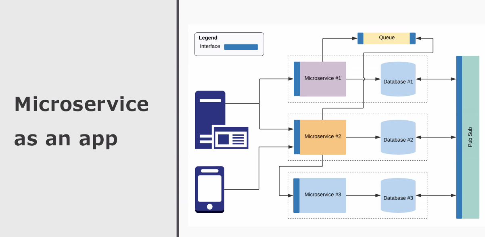
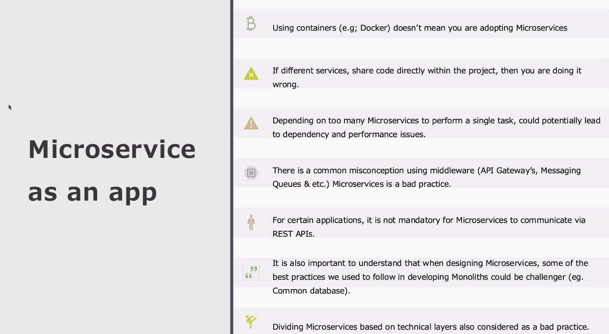
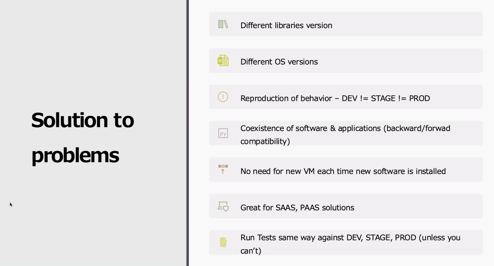
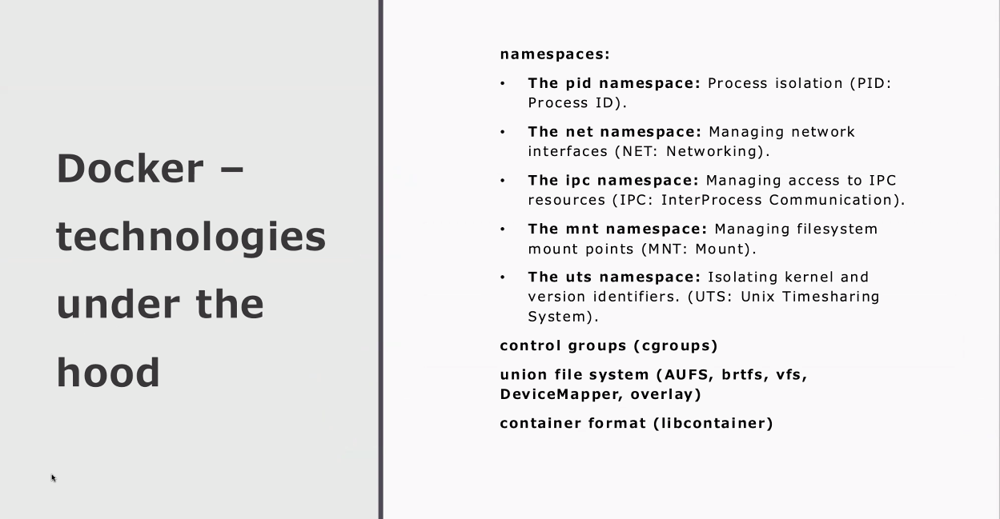
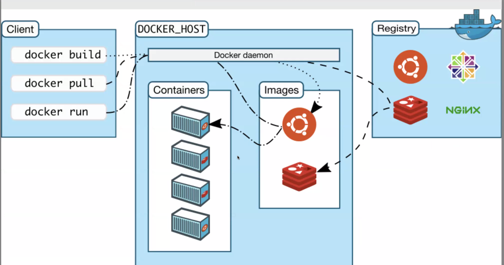

# 1. Mikroserwisy
Przykład: ls | grep | sed

Mikroserwis - wydzielony serwis, niezależny od pozostałych serwisów

Antywzorce komunikacji między mikroserwisami - pliki tekstowe, bazy danych
Wzorce komunikacji - GRPC, GraphQL, REST API


Każdy mikroserwis powinien mieć osobną bazę danych. Dla ciężkich baz danych (Oracle, MSSQL) jest to problematyczne.



# 2. Docker







## 2.1. Dockerfile

```bash
docker container run my-hello-world <params>
```
<params> nadpisuje CMD z obrazu. ENTRYPOINT zostaje bez zmian.

Przykład:
```Dockerfile
FROM alpine
LABEL imagetype="workshops"
ENTRYPOINT ["/bin/echo", "Hello"]
CMD ["world"]
```

Najpierw wykonuje się ENTRYPOINT, potem CMD, niezależnie od kolejności podania w Dockerfile'u.

ENTRYPOINT uruchamia aplikacje, CMD przyjmuje argumenty.

Warstwy, które się najczęściej zmieniają na końcu.


